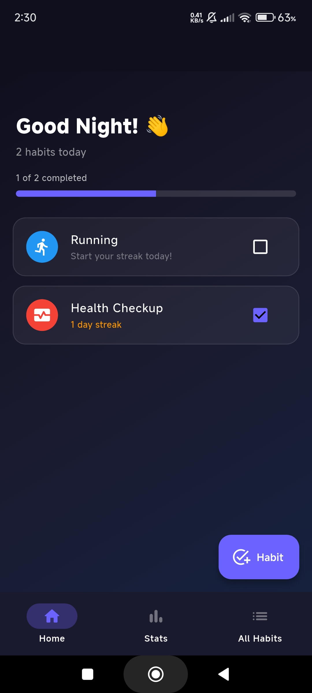
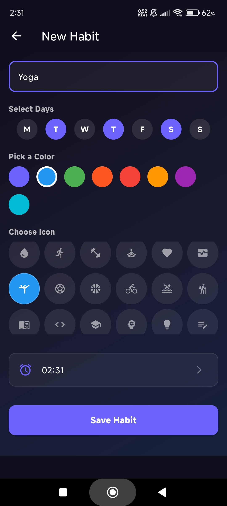
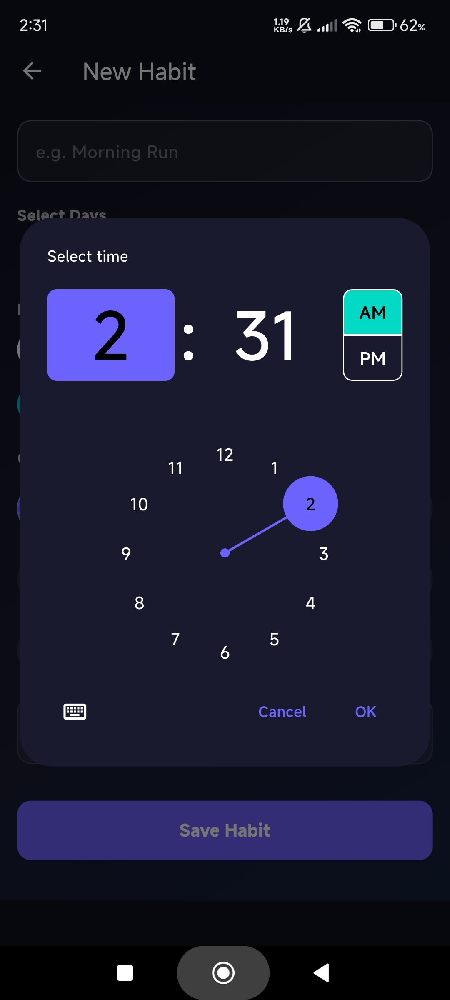
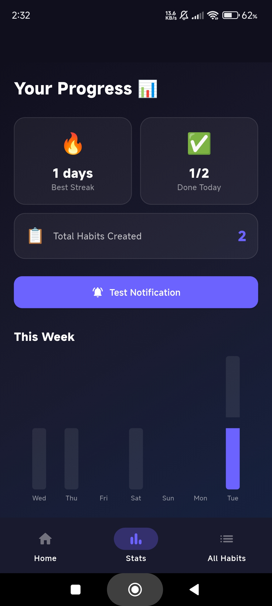

<h1 align="center">HabitFlow 🌊</h1>

<p align="center">
  <strong>A beautifully designed, feature-rich Habit Tracker built with Flutter.</strong>
</p>

<p align="center">
  Build positive routines, maintain consistency through streaks, and visualize your progress over time with stunning analytics. HabitFlow is entirely local-first, ensuring complete privacy while delivering a seamless, offline experience.
</p>

---

## ✨ Key Features

### 🏠 **Smart Home Dashboard**
* **Time-based Greetings:** Welcomes you with "Good Morning," "Good Afternoon," or "Good Night" based on the time of day.
* **Daily Focus:** Only shows the habits scheduled for today.
* **Quick Actions:** Check off habits directly from the list, or swipe to delete.
* **Progress Tracking:** A sleek progress bar shows how much of your day is completed.

### 📊 **Detailed Analytics & Statistics**
* **Weekly Insights:** A segmented bar chart showing your completion trends over the last 7 days.
* **Monthly Calendar View:** An interactive, color-coded calendar. Purple for fully completed days, orange for partially completed, and dark grey for missed days.
* **Habit Completion Rates:** See exactly how consistent you are with individual percentage bars for every habit.

### 🔔 **Custom Local Notifications**
* **Exact Time Reminders:** Set a specific time for each habit (e.g., 7:00 AM for a Morning Run). The app will notify you exactly when it's time.
* **Evening Review:** *(Optional setup)* A smart notification to remind you of any incomplete tasks before the day ends.

### 🎨 **Complete Customization**
* **36 Unique Icons & 8 Vibrant Colors:** Personalize every habit to make it your own.
* **Flexible Scheduling:** Choose exactly which days of the week a habit should repeat (e.g., Weekdays only, Every Mon/Wed/Fri).
* **Dark/Light Mode Toggle:** Seamlessly switch between a premium dark theme (glassmorphism inspired) and a clean light theme.

### 🔒 **100% Privacy & Offline First**
* Powered by **Hive** (a blazing-fast NoSQL local database). All your habits, streaks, and statistics are stored exclusively on your device. No cloud servers, no data collection.

---

## 📸 Screenshots

| Home Screen (Dark Mode) | Add New Habit |
| :---: | :---: |
|  |  |

| Select Time | Progress & Stats |
| :---: | :---: |
|  |  |


---

## 🛠️ Tech Stack

* **Framework:** [Flutter](https://flutter.dev/)
* **State Management:** Provider
* **Local Database:** [Hive](https://pub.dev/packages/hive)
* **Notifications:** `flutter_local_notifications`
* **Charts:** `fl_chart`

---

## 🚀 Getting Started

### Prerequisites
* Flutter SDK (Latest Version)
* Android Studio / VS Code
* An Android device or emulator (Android 12+ requires explicit alarm permissions)

### Installation

1. Clone the repository:
   ```bash
   git clone https://github.com/SIDDHARTH279/HabitFlow.git
   ```
2. Navigate to the project directory:
   ```bash
   cd habit_tracker
   ```
3. Install dependencies:
   ```bash
   flutter pub get
   ```
4. Run the app:
   ```bash
   flutter run
   ```

## 🤝 Contributing
Contributions, issues, and feature requests are welcome! Feel free to check the issues page.

## 📝 License
This project is open-source and available under the MIT License.
